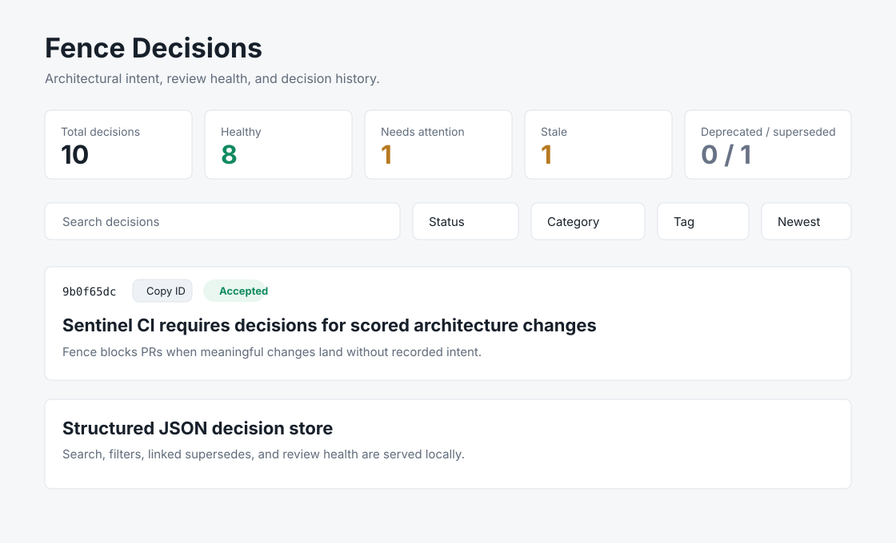
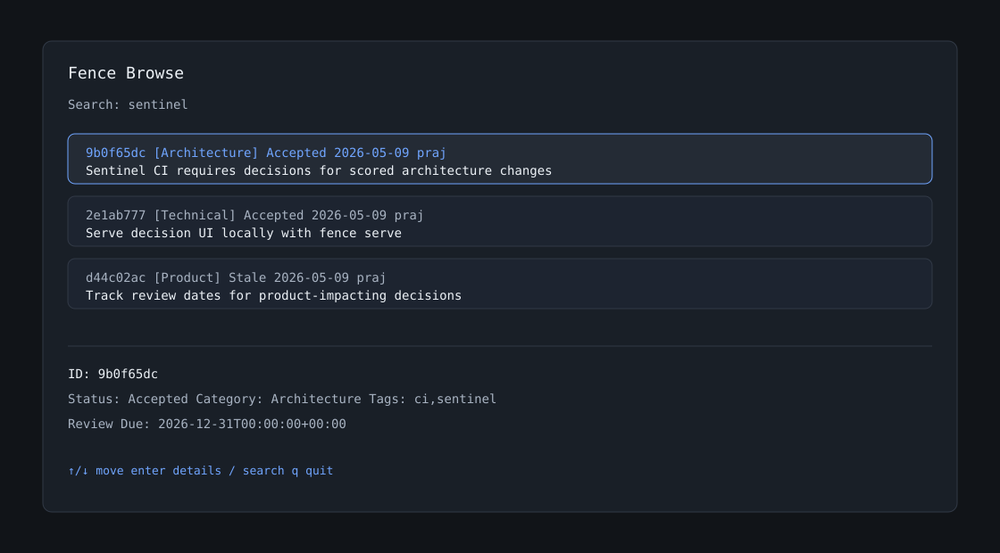
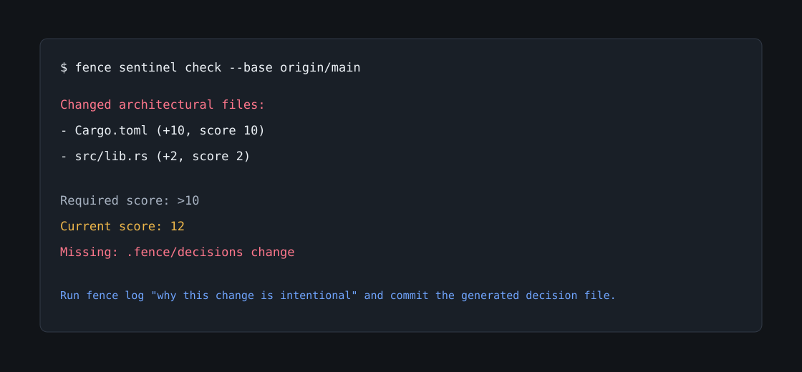

# Fence

[](https://github.com/prajwolkk/fence/actions/workflows/ci.yml)
[](https://github.com/prajwolkk/fence/actions/workflows/release.yml)
[](LICENSE)

**Keep architectural decisions in sync with code.**

Fence is a Rust CLI for recording architectural and product decisions, exporting them to readable docs, and warning or blocking when meaningful code changes land without a decision record.

Most ADR tools help you write decisions. Fence also helps you enforce the habit.

## Why Fence?

Architecture decisions usually fail in three boring ways:

- They live in somebody's memory.
- They drift away from the code they explain.
- They are only written after the argument is already over.

Fence treats decision records as part of the development workflow. It stores decisions as structured files, exports `DECISIONS.md`, and can run a Sentinel check in Git or CI to catch architectural changes that need a decision.

## Quickstart

From this repository:

```sh
cargo build --release
./target/release/fence demo
./target/release/fence init --yes
./target/release/fence log "Use Postgres for audit-safe persistence" -c architecture -t database,audit \
  --title "Audit persistence" \
  --review-due 2026-12-31 \
  --owner "@platform"
./target/release/fence list
./target/release/fence serve --open
```

For release builds, download the latest binary from GitHub Releases and put it somewhere on your `PATH`.

## Screenshots

### Web UI



### Terminal Browser



### Sentinel Blocking a PR



## Core Commands

```sh
fence init
fence init --yes
fence init --team --yes
fence init --solo --yes
```

Creates `fence.toml`, sets monitored paths, creates `.fence/decisions`, and can install a pre-commit hook. Use `--yes` for demos, templates, and scripts.

```sh
fence log "Adopt event sourcing for billing adjustments" -c architecture -t billing,events
fence log "Adopt signed audit events" \
  --title "Signed audit events" \
  --rationale "Audit records must be tamper-evident" \
  --consequences "Writers must include a signing key" \
  --review-due 2026-12-31 \
  --link https://github.com/acme/app/pull/42 \
  --owner @platform \
  --reviewer @security
```

Records a structured decision and updates `DECISIONS.md`.

```sh
fence list
fence list --json
fence show <id>
fence show <id> --json
fence search billing
fence ask "why did we choose postgres?"
```

Lists, opens, searches, and asks lightweight architectural-memory questions over local decisions.

```sh
fence amend
fence edit <id>
fence review <id> --review-due 2026-12-31
fence deprecate <id>
fence log "Replace legacy queue with durable queue" --replaces <id>
```

Updates the latest decision, deprecates a decision, or supersedes one decision with another.

```sh
fence check
fence export
fence doctor
```

Checks generated docs and Git tracking, regenerates `DECISIONS.md`, and reports setup health.

```sh
fence sentinel init
fence sentinel init --github --yes
fence sentinel check
fence sentinel check --json
fence sentinel check --markdown
fence sentinel explain --base origin/main
fence sentinel validate
```

Sets up CI automation and checks whether monitored code changes include a decision record.

```sh
fence demo
```

Creates a throwaway demo repo where Sentinel blocks a runtime dependency change until a decision is logged. This is the fastest way to see the full product loop.

```sh
fence site
```

Generates a searchable static timeline at `fence-site/index.html`.

```sh
fence serve
fence open
```

Starts the same searchable UI on localhost. Defaults to `http://127.0.0.1:7878`. `fence open` starts the server and opens the browser.

```sh
fence completions zsh
fence completions bash
fence completions fish
```

Prints shell completions for your shell.

```sh
fence migrate
```

Converts the old `decisions.log` format into structured `.fence/decisions/*.json` records.

## Decision Lifecycle

Each decision has:

- `id`
- `timestamp`
- `author`
- `branch`
- `message`
- `title`
- `rationale`
- `consequences`
- `category`
- `optional_tags`
- `status`
- `review_due`
- `supersedes`
- `superseded_by`
- `links`
- `owner`
- `reviewer`

Statuses:

- `Accepted`: active and within review window.
- `Stale`: accepted, but past its review date.
- `Deprecated`: intentionally retired.
- `Superseded`: replaced by a newer decision.
- `Proposed`: supported by the schema for future workflows.

## Sentinel

Sentinel is the enforcement layer. It compares code changes against monitored paths and scoring rules in `fence.toml`.

Example scoring:

```toml
monitored_paths = ["Cargo.toml", "src"]
ignored_paths = ["target/**", ".git/**"]
threshold = 10

[scoring]
"Cargo.toml" = 10
"src/**/*.rs" = 2
```

If the change score crosses the threshold and no `.fence/decisions` file changed, Sentinel can warn or block with a specific report:

```text
Changed architectural files:
- Cargo.toml (+10, score 10)
- src/lib.rs (+2, score 2)

Required score: >10
Current score: 12
Missing: .fence/decisions change
```

Bypasses are explicit:

- `[skip fence]`
- `nolog`

Use bypasses sparingly. The point is not bureaucracy; the point is keeping intent close to code.

## GitHub Actions

Fence ships with CI and release workflows in `.github/workflows`.

There is also a sample Sentinel workflow at [docs/examples/fence-sentinel.github-actions.yml](docs/examples/fence-sentinel.github-actions.yml).

To publish binaries, tag the release:

```sh
git tag v0.1.0
git push origin v0.1.0
```

After the release workflow finishes, verify the downloaded binary:

```sh
fence --version
```

Expected output:

```text
fence 0.1.0
```

## Docs

- [Commands](docs/commands.md)
- [Configuration](docs/configuration.md)
- [Demo scenario](docs/demo.md)
- [Sentinel](docs/sentinel.md)
- [Web UI](docs/web-ui.md)
- [Release checklist](docs/release-checklist.md)
- [V1 launch checklist](docs/v1-launch-checklist.md)

## Repository Layout

```text
.fence/decisions/      Structured decision records for this repo
.github/               Issue templates, PR template, CI, and release automation
docs/                  Focused docs and copy-paste examples
examples/              Small sample repo state for demos
src/lib.rs             Core Fence engine
src/main.rs            CLI command routing
src/tui.rs             Interactive terminal browser
src/site_template.html Static timeline template
DECISIONS.md           Generated human-readable decision table
fence.toml             Fence config for this repo
```

## Current Limitations

- Existing ADR markdown imports are not implemented yet.
- Notification failures are best-effort and do not fail the command.

## Contributing

Issues and pull requests are welcome. Start with [CONTRIBUTING.md](CONTRIBUTING.md).

## License

MIT. See [LICENSE](LICENSE).
